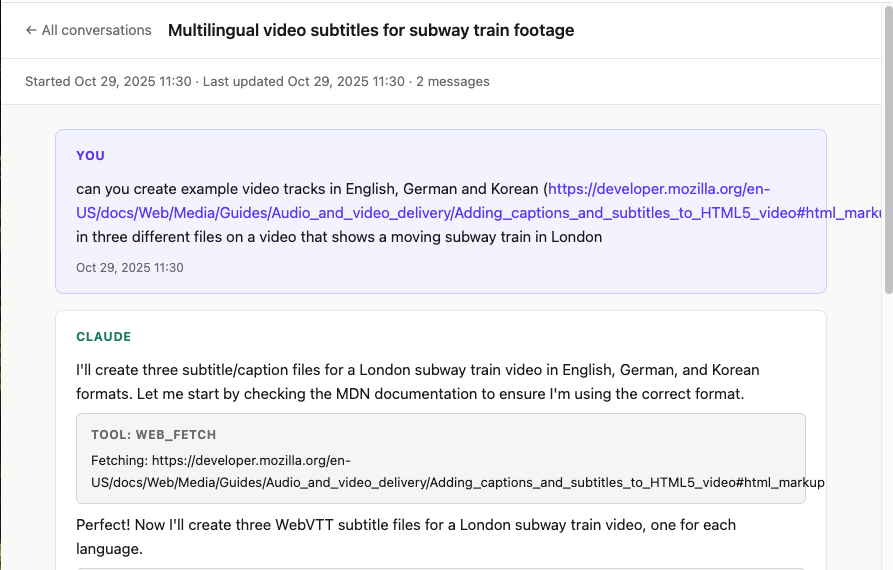
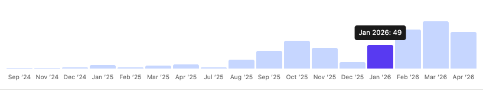
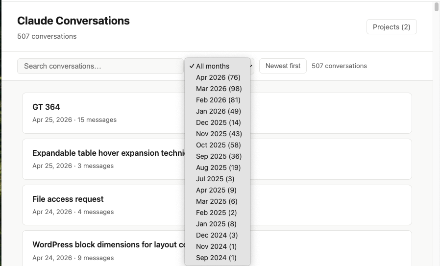

# Claude Conversations Browser

A local web app for browsing, searching, and managing your exported Claude conversation history.







## Requirements

- Python 3.8 or later
- Your exported Claude data files:
  - `conversations.json`
  - `projects.json`

## Setup

Generate the static HTML pages (needed once, or after re-importing data):

```bash
python3 generate_site.py
```

Then start the local server:

```bash
python3 serve.py
```

Open your browser at **http://localhost:9000**

## Features

### Conversation list

- **Search** — filters by conversation title and summary as you type. Press **Esc** to clear.
- **Month filter** — dropdown showing all months that have conversations, with counts (e.g. *Apr 2026 (77)*). Select "All months" to see everything.
- **Sort order** — toggle between *Newest first* and *Oldest first*.
- **Result count** — shows how many conversations match the current filter.
- **Activity chart** — click *Activity* in the header to reveal a bar chart of conversations per month. Click any bar to filter the list to that month.

### Conversation view

- Full message history with Human and Claude turns styled distinctly.
- Markdown rendered: code blocks, lists, headings, bold/italic.
- Tool use calls and results shown as collapsible labelled blocks.
- **Back** link returns to the conversation list.

### Projects

- Lists your Claude projects with descriptions and any attached documents.
- Linked from the top-right of the conversation list.

### Deleting conversations

Deletions are **permanent** — the conversation is removed from `conversations.json` and its page is deleted.

1. Hover over a conversation row — a 🗑 icon appears on the right.
2. Click once — button turns red and shows **Delete?** (3-second window).
3. Click again to confirm — the row fades out and the data is removed.

The index page updates immediately without a page reload.

## Files

```
conversations.json   — your exported conversation data (modified by deletions)
projects.json        — your exported projects data
generate_site.py     — one-time generator: builds all 509 conversation HTML pages
serve.py             — local server: serves the site and handles deletions
site/
  index.html         — conversation list (rebuilt by serve.py on start + after deletions)
  projects.html      — projects page
  c/
    <uuid>.html      — one page per conversation
```

## Re-importing data

If you export a fresh copy of your data, replace `conversations.json` and `projects.json`, then run:

```bash
python3 generate_site.py
python3 serve.py
```

`generate_site.py` rebuilds all conversation pages. `serve.py` rebuilds the index on startup.

Both scripts automatically skip any conversations you have previously deleted. Deletions are recorded in `deleted.json` (created locally, not tracked in git), so your curation survives fresh data imports.
